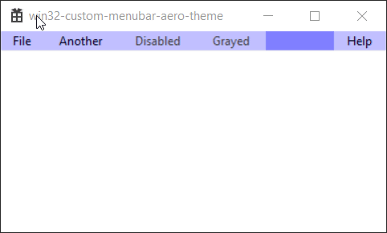
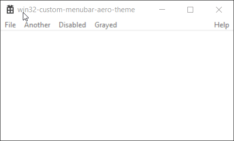

# Reaper Dark Mode

A Windows plugin that applies dark mode styling to REAPER UI elements, including menus, dialogs, list views, tree views, tab controls, edit fields, and other native Win32 components.




---

## Features

* Dark title bars and window borders
* Dark main menu (owner-drawn menu bar)
* Dark styling for dialogs and many native controls
* Support for list views, tree views, tab controls, edit fields, and more
* INI-based color configuration (optional)
* Designed specifically for REAPER on Windows

---

## Requirements

* Windows 10 or Windows 11
* REAPER for Windows
* Visual Studio / MSVC (for building from source)

---

## Build

1. Open the solution in Visual Studio
2. Select **x64** platform
3. Select **Release** configuration
4. Build the solution

---

## Installation

1. Build the project (x64 Release)

2. Copy `ReaperDarkMode.dll` to:

   ```
   %APPDATA%\REAPER\UserPlugins\
   ```

3. Restart REAPER

---

## Usage

The plugin automatically applies dark styling to supported UI elements when REAPER starts.

No additional configuration is required, but optional INI-based customization may be available.

---

## Limitations

Some native Windows dialogs (e.g. certain file overwrite prompts) use internal DirectUI rendering and may not fully support custom text coloring.

---

## Credits

This project builds upon research and techniques from:

* https://github.com/jjYBdx4IL/win32-custom-menubar-aero-theme

---

## License

This project is distributed under the included license.
